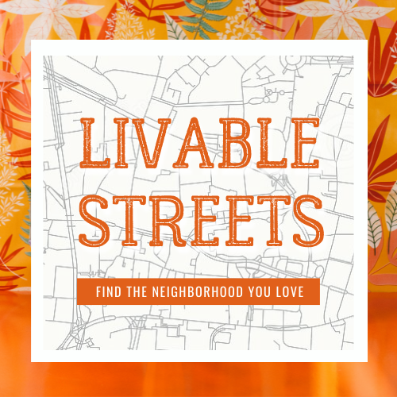

Moving to a new city can be tough. How do you decide which neighborhood to live in? Livablestreets is an open source web-tool for exploring life quality (livability) at street level, and around the world. To make your life easier, we also incorporated housing offers directly to the map, so you immediately receive most recently available offers!

It's easy and intuitive! Visit our webpage and try it out: [Livablestreets](https://livablestreets.herokuapp.com/)

Not into reading? Watch about our project on [YouTube](https://youtu.be/KkeSt6GFsLI?t=1950).

## What is livability?
In urbanism, livability is a measurement of life quality and how good it feels to live in a place.

In livablestreets, we assess the livability scores at street level in cities all over the world. These features are classified in four main categories of living standards: access to Activities/Services, Comfort, Mobility, and Social Life.

We believe livability is very individual, as each person has different needs. Because of that, we give back the power to the user and let them decide how much relevance each category has.

In the end, the livability score is calculated as the weighted mean of the four main categories of living standards. 

## Behind the curtains
1. Once the user inputs the name of the city of interest, the app collects the geographical boundary and virtually fragments it into a matrix grid of squared tiles. The tile dimension defines the spacial resolution of livability score and is set to 200 meters as standard.
2. Next step is to count the number of ~200 features (bus stops, parks, trees, etc) in each tile of the grid. This step is by far the one taking most calculation.
3. The absolut count of each feature per tile (feature density) is the basis for calculating the livability score, but it needs to be processed before we can do it. These are the 3 processing steps:
- **Blurry**: Feature density is first diluted across neighboring tiles by applying gaussian blurrying, a tool from image analysis. That's how we make features have a range of impact besides its own 200 x 200 meters tile.
- **Transform**: Livability won't necessarily scale with the feature density. For example, having two bars in the proximity of your home could be a good idea, while having 20 bars will probably impact life quality differently. Therefore we apply a polynomial transformation on the blurried feature density. 
- **Scaling**: Features do not impact life quality equally. To reflect that fact, the blurried and transformed feature density is scaled by a factor that determines the relevance of that feature to life quality. This factor was manually curated by us.
4. Once blurred, transformed and scaled, features are grouped in four categories of living standards by taking the mean value (Activities/Services, Comfort, Mobility, and Social Life). The category value is then again scaled with the weights inputed by the user for each category to calculate livability scores according to the user own needs.
5. Finally, livability scores are displayed on the map of the city of interest.

## Displaying housing offers
In parallel to calculating the livability scores, livablestreets uses the [crawler](https://github.com/chvieira2/housing_crawler) developed by chvieira2 to obtain recently posted housing ads. The user may search for 4 types of offers: flatshares (WG's in German), 1-room flats, entire flats and/or entire houses. This in unfortunatelly only available for cities in Germany.

## Running it locally
To run the app locally, simply download and install it. If you are on a linux and use pip, simply run "pip install -e ." (without the quote signs, and don't ignore the dot at the end) from the app folder in your terminal. Start it on streamlit by running "streamlit run app.py", and open the indicated Network URL.

## Why can I only select from handful of cities?
The app works for any city, however the whole calculation can take several hours. Therefore, we pre-calculated livability scores for several cities and uploaded it for you. Feel free to change the weights according to your own needs.

Want more? Don't panic. You can add more cities!

## Can I add more cities?
Yes. However, we use a free service with limited capacity to host our application (Heroku). The easiest ways to add a city are: 1) to contact us; or 2) to run the app locally.

If you run livablestreets locally, you are now free to add all cities you want. For that you should:
1. Open to livablestreets/params.py, and include the name of your city in the list of preloaded cities ("preloaded_cities" variable). City name must be spelled in the local language (several language accent markers are supported). Save the file.
2. Run livablestreets/generator.py file. The calculation may take several hours for larger cities.
3. Once done, reload the app ("streamlit run app.py") and your cities will be included as a choice in the drop down menu.

## Future applications
Besides helping you finding your next homes, we envision livablestreets as a virtual laboratory for urbanists. In the future, users will be able to add and remove features (roads, buildings, parks, businesses, etc) to evaluate the impact on livability around cities. Interested? Get in contact!

## About
Livablestreets was co-created by [Carlos H. Vieira e Vieira](https://github.com/chvieira2) and [Laia Grobe](https://github.com/Laiagdla), with contributions from [Ieva Bidermane](https://github.com/ievabi) and [Nicolas Quiroga](https://github.com/nicoquiroga941) as the conclusion project for the data science bootcamp at Le Wagon (batch 871) on June 2022. Since then, the project has been expanded and maintained by Carlos H. Vieira e Vieira.
The code is written in Python, hosted on [Heroku](https://www.heroku.com), and published with [Streamlit](https://streamlit.io/). It collects geographical data from [OpenStreetsMap](www.openstreetmap.org) through the [Overpass API](http://overpass-api.de/) and scrapes housing ads from [wg-gesucht.de](https://www.wg-gesucht.de/).
